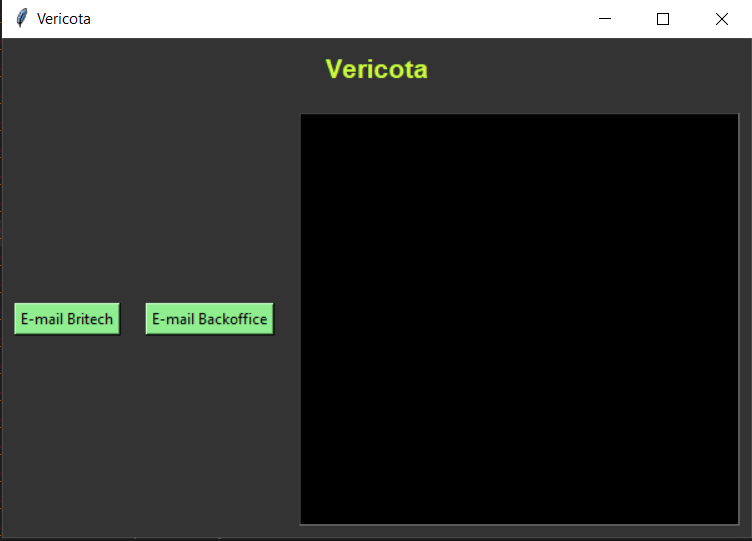

# Vericota Bot

[](https://github.com/palomaflsette/vericota/blob/master/README.md)

Vericota is a robot that performs daily verification of fluctuations in investment fund shares and positions of specific clients in certain types of financial assets.

The first verification takes place every weekday morning, with data compiled by 7:00 AM. It generates information about positions in investment funds, dividend positions, stocks, OPC, futures, BM&F, collateral, and BTC. Once compiled, this data is automatically sent to Britech's BPO and the Fiduciary Administration via the Central Operations in Excel spreadsheet format.

The second verification occurs at 5:00 PM. In this verification, an email is generated with information regarding the fluctuations in investment fund shares over a 24-hour period.

For further details about the robot's operation, please refer to the [documentation](https://ativacyber.notion.site/Vericota-cdfb5261ea1b47a5882baab2514ce8e4).


## Dev's

#### Configs

Create a separate virtual environment

Install the necessary libraries:

```sh
pip install --trusted-host pypi.org --trusted-host pypi.python.org --trusted-host files.pythonhosted.org -r requirements.txt
```

*tip: create a unique virtual environment for the robot and work on it.*

```sh
virtualenv mybotvenv
cd mybotvenv/scripts/
activate
```

Execution Options

* With scheduling (check the configured times)::

```sh
python.exe -u scheule_task.py
```

* UI (*on demand*)

```sh
python.exe -u app.py
```


