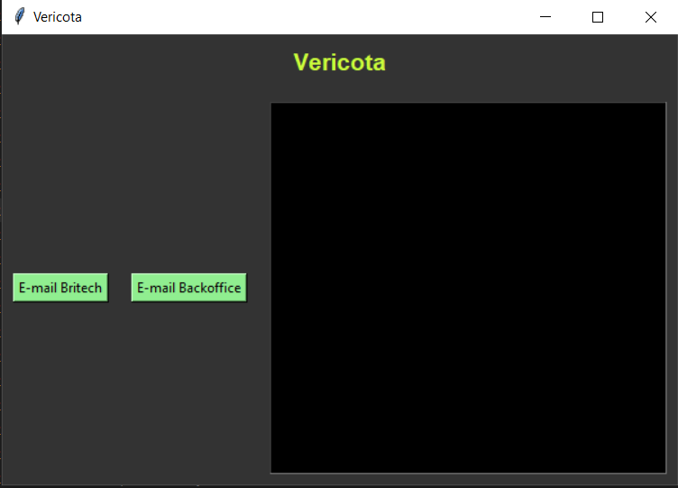

# Vericota Bot

[](https://github.com/palomaflsette/vericota/blob/master/README.es.md)

O Vericota é um robô que realiza a verificação diária de variação de cotas de fundos de investimento e de posições de determinados clientes (já fixados no código) em determinados tipos de ativos.

A primeira verificação ocorre todas as manhãs de dias úteis, sendo compilada até as 7:00 A.M. São geradas informações sobre Posições em fundos, posições em proventos, ações, OPC, termo, BM&F, garantias e BTC. Após compiladas, são enviadas em automaticamente ao BPO da Britech e à Administração Fiduciária através da Central Operação em formato de planilhas do Excel.

A segunda verificação ocorre às 17:00. Nesta, é gerado um e-mail com informações a respeito das variações de cotas em fundos de investimento em um período de 24h.

Para mais informações acerca da execução do robô, consulte a [documentação](https://ativacyber.notion.site/Vericota-cdfb5261ea1b47a5882baab2514ce8e4).

## Dev's

#### Configuração

Crie um ambiente virtual separadamente

Instale as libs necessárias:

```sh
pip install --trusted-host pypi.org --trusted-host pypi.python.org --trusted-host files.pythonhosted.org -r requirements.txt
```

*dica: crie um ambiente virtual exclusivo para o robô e trabalhe em cima do mesmo.*

```sh
$ virtualenv mybotvenv
$ cd mybotvenv/scripts/
$ activate
```

Opções de execução

* Com agendamento (verifique os horários configurados):

```sh
python.exe -u scheule_task.py
```

* Interface (*on demand*)

```sh
python.exe -u app.py
```

